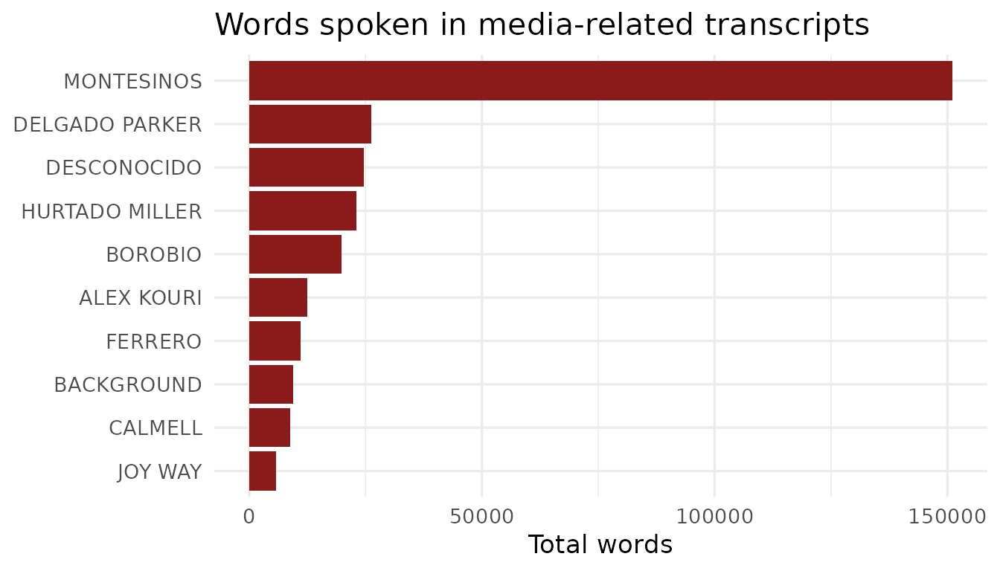

# Getting Started with BribeR

## Overview

**{BribeR}** is an R package for accessing and analyzing the
*Vladivideos* — a collection of secret recordings documenting Vladimiro
Montesinos, Peru’s intelligence chief under President Alberto Fujimori,
bribing politicians, judges, military officers, media owners, and
businesspeople throughout the 1990s. The recordings were declassified
and made public in 2000 and have since become a landmark dataset for the
study of corruption, state capture, and authoritarian politics.

The package provides structured, machine-readable access to 101
transcripts along with metadata on speakers, topics, and institutional
roles. It includes six main functions:

| Function | Description |
|----|----|
| [`read_transcripts()`](https://jessietrudeau.github.io/BribeR/reference/read_transcripts.md) | Load the full transcript corpus, optionally filtered by ID |
| [`get_transcript_id()`](https://jessietrudeau.github.io/BribeR/reference/get_transcript_id.md) | Find transcript IDs by speaker or topic |
| [`get_transcript_speakers()`](https://jessietrudeau.github.io/BribeR/reference/get_transcript_speakers.md) | Get speakers associated with each transcript |
| [`get_transcripts_raw()`](https://jessietrudeau.github.io/BribeR/reference/get_transcripts_raw.md) | Load the raw source CSV files |
| [`read_transcript_meta_data()`](https://jessietrudeau.github.io/BribeR/reference/read_transcript_meta_data.md) | Build a tidy metadata summary per transcript |
| [`run_transcript_network_app()`](https://jessietrudeau.github.io/BribeR/reference/run_transcript_network_app.md) | Launch an interactive network visualization app |

## Installation

``` r

# Install from CRAN
install.packages("BribeR")

# Or install the development version from GitHub
remotes::install_github("jessietrudeau/BribeR")
```

## Loading Transcripts

The main entry point is
[`read_transcripts()`](https://jessietrudeau.github.io/BribeR/reference/read_transcripts.md),
which loads the full corpus as a tidy data frame. Each row is one speech
turn, with columns for the transcript ID (`n`), speaker, speech text,
standardized speaker name, date, and topic.

``` r

library(BribeR)

transcripts <- read_transcripts()
head(transcripts)
#> # A tibble: 6 × 7
#>       n row_id date      speaker              speech           speaker_std topic
#>   <dbl>  <int> <chr>     <chr>                <chr>            <chr>       <chr>
#> 1     1      1 3/25/1997 BACKGROUND           Declaraciones …  BACKGROUND  topi…
#> 2     1      2 3/25/1997 BACKGROUND           [La entrevista … BACKGROUND  topi…
#> 3     1      3 3/25/1997 La señora            Levante su mano… ALVA        topi…
#> 4     1      4 3/25/1997 El señor Javier Alva Sí.              ALVA        topi…
#> 5     1      5 3/25/1997 El señor Neil Lewis  Señor Alva, mi … LEWIS       topi…
#> 6     1      6 3/25/1997 El señor Javier Alva Javier Alva Orl… ALVA        topi…
```

You can filter to one or more transcripts by passing their numeric IDs:

``` r

t1     <- read_transcripts(transcripts = 1)
subset <- read_transcripts(transcripts = c(5, 12, 47))

nrow(t1)
#> [1] 697
nrow(subset)
#> [1] 1324
```

## Finding Transcripts by Speaker or Topic

[`get_transcript_id()`](https://jessietrudeau.github.io/BribeR/reference/get_transcript_id.md)
returns transcript IDs matching any combination of speakers and topics.
Filters use OR logic: a transcript is returned if **any** of the
specified speakers appear in it, or if **any** of the specified topics
are flagged.

``` r

# All available transcript IDs
all_ids <- get_transcript_id()
length(all_ids)
#> [1] 101

# Transcripts featuring Montesinos
montesinos_ids <- get_transcript_id(speaker = "montesinos")
length(montesinos_ids)
#> [1] 88

# Transcripts about media manipulation
media_ids <- get_transcript_id(topic = "media")
length(media_ids)
#> [1] 38
```

Available topic names include: `referendum`, `ecuador`,
`lucchetti_factory`, `municipal98`, `reelection`, `miraflores`,
`canal4`, `media`, `promotions`, `ivcher`, `foreign`, `wiese`,
`public_officials`, `safety`, and `state_capture`.

## Getting Speakers Per Transcript

[`get_transcript_speakers()`](https://jessietrudeau.github.io/BribeR/reference/get_transcript_speakers.md)
returns a tibble with one row per speaker and a list-column of the
transcript IDs they appear in.

``` r

speakers <- get_transcript_speakers()
head(speakers)
#> # A tibble: 6 × 2
#>   speaker_std   transcripts
#>   <chr>         <list>     
#> 1 ALBARRACIN    <dbl [2]>  
#> 2 ALBERTO KOURI <dbl [1]>  
#> 3 ALEX KOURI    <dbl [11]> 
#> 4 ALVA          <dbl [1]>  
#> 5 AMERICANO     <dbl [2]>  
#> 6 AMOIN         <dbl [1]>
```

Each entry in the `transcripts` column is a numeric vector of IDs. You
can use [`lengths()`](https://rdrr.io/r/base/lengths.html) to count
appearances:

``` r

library(dplyr)
#> 
#> Attaching package: 'dplyr'
#> The following objects are masked from 'package:stats':
#> 
#>     filter, lag
#> The following objects are masked from 'package:base':
#> 
#>     intersect, setdiff, setequal, union

speakers |>
  mutate(n_transcripts = lengths(transcripts)) |>
  arrange(desc(n_transcripts)) |>
  head(10)
#> # A tibble: 10 × 3
#>    speaker_std       transcripts n_transcripts
#>    <chr>             <list>              <int>
#>  1 MONTESINOS        <dbl [88]>             88
#>  2 HERNANDEZ CANELO  <dbl [18]>             18
#>  3 SERPA             <dbl [14]>             14
#>  4 ALEX KOURI        <dbl [11]>             11
#>  5 DELGADO PARKER    <dbl [11]>             11
#>  6 VILLANUEVA RUESTA <dbl [11]>             11
#>  7 IBARCENA          <dbl [10]>             10
#>  8 ARCE              <dbl [9]>               9
#>  9 LOCUTOR           <dbl [8]>               8
#> 10 MONTES DE OCA     <dbl [8]>               8
```

## Transcript Metadata

[`read_transcript_meta_data()`](https://jessietrudeau.github.io/BribeR/reference/read_transcript_meta_data.md)
assembles a one-row-per-transcript summary combining dates, speaker
rosters, word counts, and topic flags.

``` r

meta <- read_transcript_meta_data()
head(meta)
#> # A tibble: 6 × 5
#>       n date      speakers   n_words topics   
#>   <dbl> <chr>     <list>       <int> <list>   
#> 1   104 7/1/2000  <chr [2]>     9289 <chr [2]>
#> 2    19 4/21/1998 <chr [11]>    5693 <chr [2]>
#> 3    11 2/10/1998 <chr [3]>     9420 <chr [1]>
#> 4    12 2/10/1998 <chr [2]>     1283 <chr [1]>
#> 5     5 1/8/1998  <chr [5]>     9391 <chr [2]>
#> 6     7 1/15/1998 <chr [6]>    11146 <chr [3]>
```

``` r

# Five longest transcripts by word count
meta |>
  arrange(desc(n_words)) |>
  select(n, date, n_words) |>
  head(5)
#> # A tibble: 5 × 3
#>       n date      n_words
#>   <dbl> <chr>       <int>
#> 1    34 8/11/1998   29161
#> 2    54 3/19/1999   28813
#> 3    33 8/2/1998    20880
#> 4    70 8/25/1999   19659
#> 5    35 8/14/1998   18247
```

## Loading Raw Transcripts

[`get_transcripts_raw()`](https://jessietrudeau.github.io/BribeR/reference/get_transcripts_raw.md)
provides access to the original source CSV files, useful when you need
the unprocessed data before compilation.

``` r

# Load transcript 3 as a data frame
t3 <- get_transcripts_raw(n = 3)

# Load multiple transcripts combined into a single tibble
combined <- get_transcripts_raw(n = c(3, 19, 47), combine = TRUE)
```

## Putting It Together

A common workflow is to identify transcripts of interest, load them, and
then analyze the text. The example below finds all transcripts about
media manipulation, loads them, and summarizes how much each speaker
said.

``` r

library(ggplot2)

# Step 1: find relevant transcript IDs
media_ids <- get_transcript_id(topic = "media")

# Step 2: load just those transcripts
media_transcripts <- read_transcripts(transcripts = media_ids)

# Step 3: count words spoken per actor
media_transcripts |>
  mutate(n_words = lengths(strsplit(speech, "\\s+"))) |>
  group_by(speaker_std) |>
  summarise(total_words = sum(n_words, na.rm = TRUE), .groups = "drop") |>
  arrange(desc(total_words)) |>
  head(10) |>
  ggplot(aes(x = reorder(speaker_std, total_words), y = total_words)) +
  geom_col(fill = "#8B1A1A") +
  coord_flip() +
  labs(
    title = "Words spoken in media-related transcripts",
    x     = NULL,
    y     = "Total words"
  ) +
  theme_minimal(base_size = 13)
```



## Network Visualization App

[`run_transcript_network_app()`](https://jessietrudeau.github.io/BribeR/reference/run_transcript_network_app.md)
launches an interactive Shiny application with two network views:

- **Speaker–Topic Network**: connects speakers to the topics discussed
  in their transcripts. Node size reflects the number of transcripts a
  speaker appears in; color reflects institutional type.
- **Speaker Co-Appearance Network**: connects speakers who appear in the
  same transcript, with edge weight proportional to co-appearance
  frequency.

``` r

run_transcript_network_app()
```
