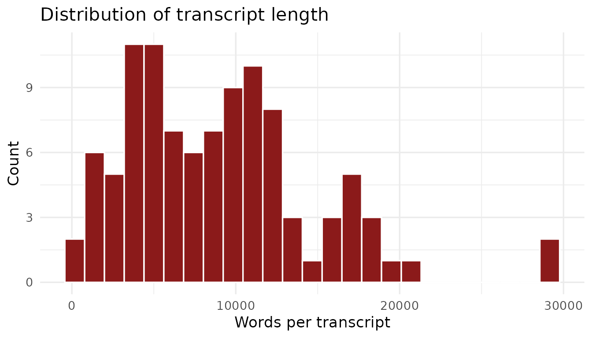
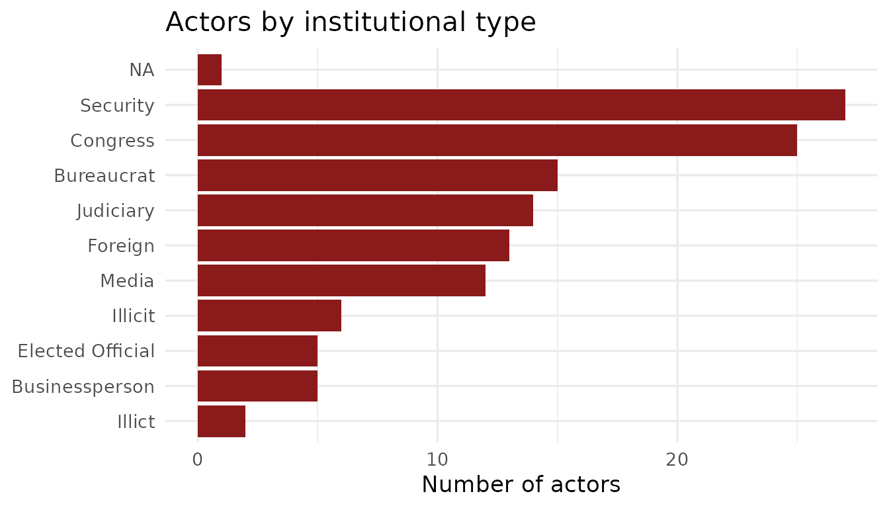
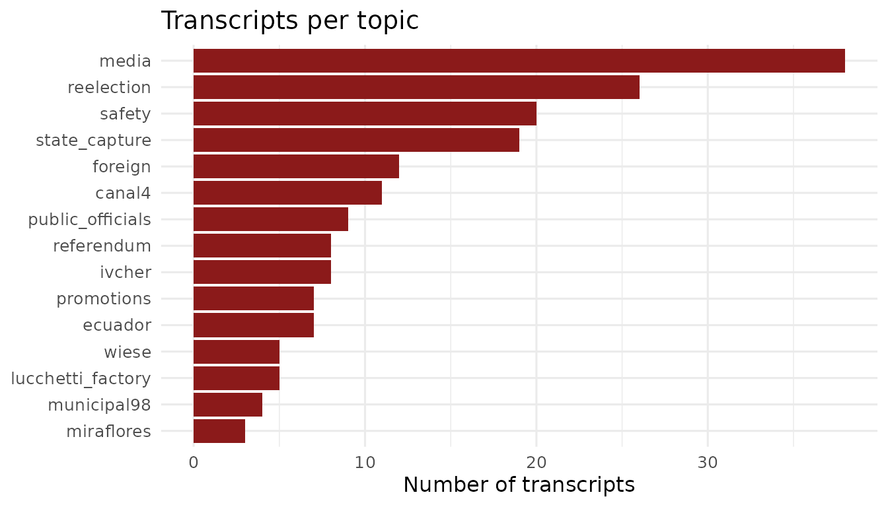
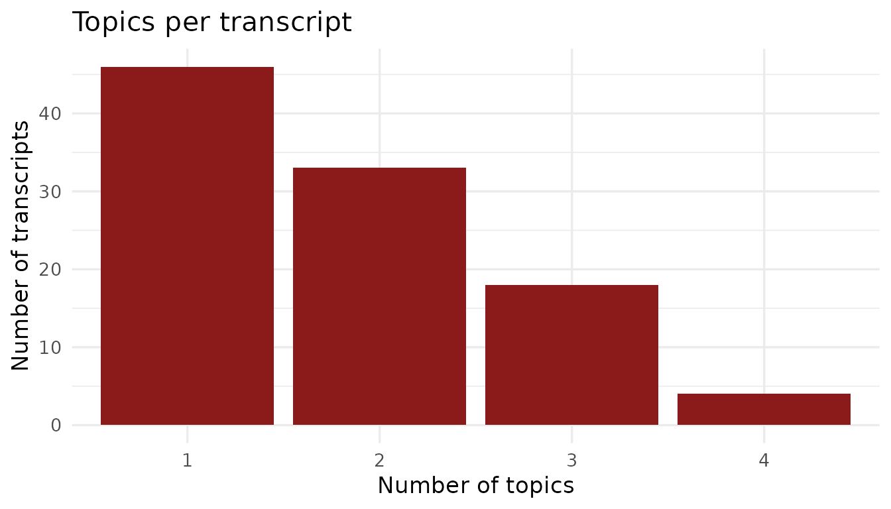

# Raw Data Guide

## About the Vladivideos

(PICTURE)

Between 1990 and 2000, Vladimiro Montesinos Torres — the head of Peru’s
National Intelligence Service under President Alberto Fujimori —
secretly recorded meetings in which he bribed politicians, judges,
military officers, media executives, and businesspeople. Most of the
aptly named *Vladivideo* footage (and subsequent transcripts included in
this package) was covertly recorded from within Montesinos’ office,
unbeknownst to his counterparts.

Select recordings became public in 2000 and triggered the collapse of
the Fujimori government. The rest were made public in 2001 during
Congressional investigations and criminal proceedings. The Fujimori
presidency remains one of the most extensively documented cases of
systemic corruption in Latin American history, thanks to the evidence
from the *Vladivideos.*

The videos capture corruption across every major institution of the
Peruvian state: legislators accepting cash to switch party allegiances,
television channel owners receiving monthly payments to censor news
coverage, military generals coordinating electoral suppression, and
judges confirming their availability to rule in Montesinos’s favor.

See, for example, the snippet of this exchange about consolidating power
in the judicial branch between Montesinos and Alipio Montes de Oca,
Supreme Court Judge (Transcript 888, May 3, 1998):

    <button onclick="showQuote('eng')" type="button">ENG</button>
    <button onclick="showQuote('esp')" type="button">ESP</button>

    <p><strong>Mr. MONTES DE OCA —</strong> Okay, just say it.</p>

    <p><strong>Mr. MONTESINOS TORRES —</strong> The first is that you rejoin the Executive Commission.</p>

    <p><strong>Mr. MONTES DE OCA —</strong> Okay.</p>

    <p><strong>Mr. MONTESINOS TORRES —</strong> Because on Monday I have to make a move.</p>

    <p><strong>Mr. MONTES DE OCA —</strong> Okay.</p>

    <p><strong>Mr. MONTESINOS TORRES —</strong> I already spoke with Víctor Raúl and with Serpa; they agree that (unintelligible). Someone has told them what we are going to do on Monday. And the next step is (unintelligible) the National Elections Jury (unintelligible), the President of the Jury (unintelligible).</p>

    <p><strong>Mr. MONTES DE OCA —</strong> Right, that is why I am asking you for (unintelligible), and what we had agreed on, remember (unintelligible). So we talk more directly here; we leave it that way (unintelligible).</p>

    <p><strong>El señor MONTES DE OCA —</strong> Ya, di no más.</p>

    <p><strong>El señor MONTESINOS TORRES —</strong> La primera es que te reincorpores a la Comisión Ejecutiva.</p>

    <p><strong>El señor MONTES DE OCA —</strong> Ya.</p>

    <p><strong>El señor MONTESINOS TORRES —</strong> Porque el lunes tengo que dar un golpe.</p>

    <p><strong>El señor MONTES DE OCA —</strong> Ya.</p>

    <p><strong>El señor MONTESINOS TORRES —</strong> Ya hablé con Víctor Raúl y con Serpa, están de acuerdo en que los (ininteligible) alguien les ha dicho lo que vamos a hacer el lunes. Y el siguiente paso es (ininteligible) del Jurado Nacional de Elecciones (ininteligible) el Presidente del Jurado (ininteligible).</p>

    <p><strong>El señor MONTES DE OCA —</strong> Ya, por eso yo te estoy pidiendo (ininteligible) y que habíamos quedado te acuerdas (ininteligible). Entonces, conversamos más directos acá, quedamos así (ininteligible).</p>

**BribeR** provides structured access to transcripts of 101 of these
recordings, which contain 47,375 individual speech turns. The package
also includes relevant metadata about 125 recorded speakers and 15
topics.

This page introduces the raw data, highlighting how it is organized at
the transcript-, actor-, and topic-level. This page uses some of the
core functions in **BribeR**, all of which are detailed in the [**User
Guide**](https://jessietrudeau.com/BribeR/articles/using_briber.html)**.**

## Transcripts

``` r

library(BribeR)
library(dplyr)
library(ggplot2)

meta <- read_transcript_meta_data()
nrow(meta)
#> [1] 104
```

The corpus spans recordings made between 1996 and 2000, covering the
period after Fujimori’s successful bid for a second term through the
final months before the regime’s collapse. Transcripts were collected
from two main sources:

- **LUM digital collections:** 62 transcripts accessed through the
  [digital
  holdings](https://lum.cultura.pe/cdi/busqueda/colecciones?field_coleccion=55&field_palabra_clave%5B%5D=13462&field_year=)
  of the *Lugar de la Memoria, la Tolerancia y la Inclusión* Social
  (LUM).
- **Congressional print volumes:** 39 transcripts from the six-volume
  collection [*En la sala de la corrupción: Videos y audios de Vladimiro
  Montesinos
  (1998–2000)*](https://books.google.com/books/about/En_la_sala_de_la_corrupci%C3%B3n.html?id=q7XHPgAACAAJ),
  edited by Antonio Zapata Velasco and published by the Fondo Editorial
  del Congreso del Perú. These volumes reproduce records originally made
  available by the Peruvian Congress, including the transcripts
  available through LUM as well as additional transcripts not available
  in LUM’s online database. We digitized and OCRed the transcripts that
  were present only in the print volumes.

``` r

summary(meta$n_words)
#>    Min. 1st Qu.  Median    Mean 3rd Qu.    Max.     NAs 
#>     175    4544    8547    8946   11721   29161       3
```

Transcripts range from brief exchanges of a few hundred words to lengthy
multi-hour meetings exceeding 18,000 words. The median transcript is
approximately 2,500 words.

``` r

ggplot(meta, aes(x = n_words)) +
  geom_histogram(bins = 25, fill = "#8B1A1A", color = "white") +
  labs(
    title = "Distribution of transcript length",
    x     = "Words per transcript",
    y     = "Count"
  ) +
  theme_minimal(base_size = 13)
#> Warning: Removed 3 rows containing non-finite outside the scale range
#> (`stat_bin()`).
```



## Actors

Users can access biographical and institutional metadata for the 125
individuals named in the Vladivideos transcripts through the `actors`
dataset. Each person is classified by their institutional role at the
time of the recordings.

``` r

head(actors[, c("speaker", "Position", "Type", "Party", "speaker_std")])
#> # A tibble: 6 × 5
#>   speaker                         Position               Type  Party speaker_std
#>   <chr>                           <chr>                  <chr> <chr> <chr>      
#> 1 Vladimir Montesinos             Alberto Fujimori's Ch… Secu… NA    MONTESINOS 
#> 2 Desconocido                     NA                     NA    NA    DESCONOCIDO
#> 3 Alexander Martin Kouri Bumachar Elected Constituent C… Cong… Part… ALEX KOURI 
#> 4 Lucchetti                       Company specialized i… Busi… NA    LUCCHETTI  
#> 5 Carlos Eduardo Ferrero Costa    Congressman (1995-200… Cong… Camb… FERRERO    
#> 6 Alberto Fujimori                President of Peru (19… Elec… NA    FUJIMORI
```

Actors are grouped into nine categories:

| Type | Count | Description |
|----|----|----|
| `Security` | 31 | Military and police officers |
| `Congress` | 25 | Members of Congress, including opposition members bribed to switch allegiance |
| `Judiciary` | 18 | Judges, prosecutors, and members of the electoral tribunal |
| `Media` | 14 | Television channel and newspaper executives |
| `Businessperson` | 12 | Private sector executives and financiers |
| `Elected Official` | 9 | Mayors, executives, and (non-Congressional) other elected officials |
| `Bureaucrat` | 8 | Senior civil servants and agency heads |
| `Illicit` | 5 | Individuals primarily associated with armed groups |
| `Foreign` | 3 | Foreign officials and diplomats |

This figure shows that the three most common types of actors to be
recorded are members of the security sector, congresspeople, and
bureaucrats.

``` r

actors |>
  count(Type, sort = TRUE) |>
  ggplot(aes(x = reorder(Type, n), y = n)) +
  geom_col(fill = "#8B1A1A") +
  coord_flip() +
  labs(
    title = "Actors by institutional type",
    x     = NULL,
    y     = "Number of actors"
  ) +
  theme_minimal(base_size = 13)
```



Very few transcripts label a speaker as `DESCONOCIDO` (unidentified),
but when a speaker is unidentified, they are often acting as a messenger
and quickly exit, or are largely silent for the conversation except for
salutations.

## Topics

Each transcript is hand-coded[^1] and classified by topic(s). The 15
topics include:

| Topic | Description |
|----|----|
| `state_capture` | Co-optation of state institutions |
| `reelection` | Fujimori’s 2000 reelection campaign |
| `media` | Bribery of television channels and newspapers |
| `promotions` | Military and police promotions in exchange for loyalty |
| `foreign` | Foreign policy and international relations |
| `ivcher` | The case of Baruch Ivcher, a media owner stripped of citizenship |
| `canal4` | Dealings with Canal 4 (RBC Televisión) |
| `security` | Domestic public security and anti-opposition suppression |
| `wiese` | Wiese banking group |
| `lucchetti_factory` | Lucchetti factory zoning controversy |
| `ecuador` | 1995 border conflict with Ecuador |
| `referendum` | Presidental term limits referendum |
| `municipal98` | 1998 municipal elections |
| `miraflores` | 1998 Miraflores district elections |
| `public_officials` | Interactions with civil servants and bureaucrats |

As demonstrated by [McMillan and
Zoido](https://www.aeaweb.org/articles?id=10.1257/0895330042632690)
(2004), capture of the media was the most common topic discussed in the
*Vladivideos*, followed by Fujimori’s reelection campaign in 2000 and
domestic security operations.

``` r

topic_names <- c(
  "state_capture", "reelection", "media", "promotions", "foreign",
  "ivcher", "canal4", "safety", "wiese", "lucchetti_factory",
  "ecuador", "referendum", "municipal98", "miraflores", "public_officials"
)

topic_counts <- sapply(topic_names, function(t) {
  length(get_transcript_id(topic = t))
})

data.frame(topic = topic_names, n = topic_counts) |>
  ggplot(aes(x = reorder(topic, n), y = n)) +
  geom_col(fill = "#8B1A1A") +
  coord_flip() +
  labs(
    title = "Transcripts per topic",
    x     = NULL,
    y     = "Number of transcripts"
  ) +
  theme_minimal(base_size = 12)
```



Many of the conversations in *Vladivideo* recordings covered more than
one topic.

``` r

meta |>
  mutate(n_topics = lengths(topics)) |>
  count(n_topics) |>
  ggplot(aes(x = factor(n_topics), y = n)) +
  geom_col(fill = "#8B1A1A") +
  labs(
    title = "Topics per transcript",
    x     = "Number of topics",
    y     = "Number of transcripts"
  ) +
  theme_minimal(base_size = 13)
```



[^1]: Each transcript was read and validated by 2-3 native
    Spanish-language speakers and classified as pertaining to one or
    more relevant topics.
