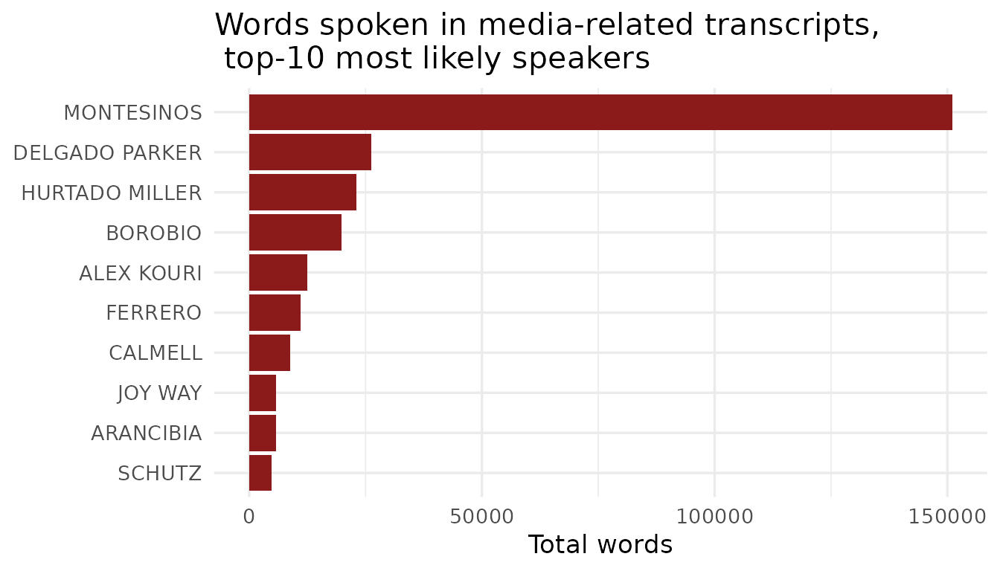
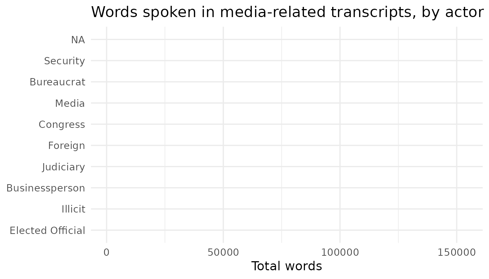

# Using BribeR

**BribeR** provides structured, full-text access to 101 *Vladivideo*
transcripts, along with metadata about the conversations, speakers, and
topics. This vignette introduces the three main families of functions
(below) and provides user-friendly examples for how to use **BribeR.**

**1. Read transcripts**

**2. Find transcripts**

**3. Integrate with metadata**

To begin, install and load the package:

``` r

# Install from CRAN
install.packages("BribeR")

# Or install the development version from GitHub
remotes::install_github("jessietrudeau/BribeR")
```

``` r

# Load packages
library(BribeR)
library(dplyr)
#> 
#> Attaching package: 'dplyr'
#> The following objects are masked from 'package:stats':
#> 
#>     filter, lag
#> The following objects are masked from 'package:base':
#> 
#>     intersect, setdiff, setequal, union
```

## Read transcripts

Use
[`read_transcripts()`](https://jessietrudeau.github.io/BribeR/reference/read_transcripts.md)
to access the corpus of full-text transcripts as a tidy data frame. Each
row corresponds to one speech turn, indexed by transcript ID (`id`),
speaker, standardized speaker name, speech text, date, and (DELETE
THIS - topic?).

``` r

# Get full-text transcripts 
transcripts <- read_transcripts()

# Additional variables
colnames(transcripts)
#> [1] "n"           "row_id"      "date"        "speaker"     "speech"     
#> [6] "speaker_std" "topic"

head(transcripts)
#> # A tibble: 6 × 7
#>       n row_id date      speaker              speech           speaker_std topic
#>   <dbl>  <int> <chr>     <chr>                <chr>            <chr>       <chr>
#> 1     1      1 3/25/1997 BACKGROUND           Declaraciones …  BACKGROUND  topi…
#> 2     1      2 3/25/1997 BACKGROUND           [La entrevista … BACKGROUND  topi…
#> 3     1      3 3/25/1997 La señora            Levante su mano… ALVA        topi…
#> 4     1      4 3/25/1997 El señor Javier Alva Sí.              ALVA        topi…
#> 5     1      5 3/25/1997 El señor Neil Lewis  Señor Alva, mi … LEWIS       topi…
#> 6     1      6 3/25/1997 El señor Javier Alva Javier Alva Orl… ALVA        topi…
```

You can filter to one or more transcripts using their numeric IDs:

``` r

# Select first transcript
t1 <- read_transcripts(transcripts = 1)
nrow(t1)
#> [1] 697

# Select multiple transcripts 
t_sub <- read_transcripts(transcripts = c(5, 12, 47))
nrow(t_sub)
#> [1] 1324
```

### Read raw transcript data

[`get_transcripts_raw()`](https://jessietrudeau.github.io/BribeR/reference/get_transcripts_raw.md)
provides access to the original source CSV files for users who wish to
access the data before compilation.

``` r

# Load transcript 3 as a data frame
t3 <- get_transcripts_raw(n = 3)
head(t3)

# Load multiple transcripts combined into a single tibble
combined <- get_transcripts_raw(n = c(3, 19, 47), combine = TRUE)
```

## Find transcripts

Often, users may not know the numerid `id` they wish to read transcripts
by, but know the actor(s) or topic(s) they wish to focus on.
[`get_transcript_id()`](https://jessietrudeau.github.io/BribeR/reference/get_transcript_id.md)
is the primary function used to filter transcripts by speaker or topic
characteristics.

### By actor

The
[`get_transcript_id()`](https://jessietrudeau.github.io/BribeR/reference/get_transcript_id.md)
function accepts lowercase string values for the standardized speaker’s
name (the `speaker_std` variable), and returns transcript IDs where
these speakers are present.

``` r

# Transcripts featuring Montesinos
montesinos_ids <- get_transcript_id(speaker = "montesinos")
length(montesinos_ids)
#> [1] 88
montesinos_ids
#>  [1]   5   6   7   8   9  10  11  12  13  14  15  16  17  19  20  21  22  23  24
#> [20]  25  26  27  28  29  30  31  32  33  34  35  36  37  38  39  40  41  44  45
#> [39]  46  47  48  49  50  51  52  56  57  58  59  60  61  62  63  64  65  66  67
#> [58]  68  69  70  71  72  73  74  75  76  77  78  79  80  81  82  83  84  85  86
#> [77]  87  88  89  90  94  95  96  97  98 102 103 104

# Transcripts featuring Alex Kouri
kouri_ids <- get_transcript_id(speaker = "kouri")
length(kouri_ids)
#> [1] 7
kouri_ids
#> [1]  7 10 76 78 82 83 86
```

There are 125 valid speaker IDs that the `speaker_std` variable can take
on. These are available (WHERE???)

### By topic

Similarly,
[`get_transcript_id()`](https://jessietrudeau.github.io/BribeR/reference/get_transcript_id.md)
function accepts lowercase string values for topic names, and returns
returns transcript IDs where these topics are discussed.

``` r

# Transcripts about media manipulation
media_ids <- get_transcript_id(topic = "media")
length(media_ids)
#> [1] 38
media_ids
#>  [1]   4   6   7   8   9  24  25  33  34  35  39  41  42  43  44  45  50  55  56
#> [20]  58  59  62  70  71  72  73  74  75  79  86  87  88  90  94  95  97 102 103

# Transcripts about both/either media and reelection 
media_reelection_ids <- get_transcript_id(topic = c("media", "reelection"))
length(media_reelection_ids)
#> [1] 56
```

There are 15 valid topics, detailed in the BribeR Data Guide:
`referendum`, `ecuador`, `lucchetti_factory`, `municipal98`,
`reelection`, `miraflores`, `canal4`, `media`, `promotions`, `ivcher`,
`foreign`, `wiese`, `public_officials`, `SAFETY(???)`, and
`state_capture`.

### By both

Finally, users can filter transcripts by actor and topic. This function
uses AND logic and returns transcript IDs if **any** of the specified
speakers appear alongside **any** of the specified topics.

``` r

# Find transcripts about ecuador  
ecuador_ids <- get_transcript_id(topic = "ecuador")
length(ecuador_ids)
#> [1] 7

# Find transcripts about ecuador where a Sendero Luminoso (armed group) leader is present 
morote_ids <- get_transcript_id(topic = "ecuador", speaker = "morote")
length(morote_ids)
#> [1] 8

## Transcripts about montesinos and/or media (?)
montesinos_media <- get_transcript_id(
  speaker = "montesinos",
  topic   = "media"
)
length(montesinos_media)
#> [1] 92
```

## Integrate with metadata

Rich transcript-level and actor-level metadata is available in
**BribeR**.

The
[`read_transcript_meta_data()`](https://jessietrudeau.github.io/BribeR/reference/read_transcript_meta_data.md)
function presents transcript-level data containing dates,
summaries\[^1\], speakers present, topics mentioned, and word counts.

When left blank, it returns the metadata for every transcript in the
corpus, but can also be filtered using the transcript `id` variable.

\[^1\] These summaries were written by undergraduate native-Spanish
speakers.

``` r

meta <- read_transcript_meta_data()
head(meta)
#> # A tibble: 6 × 5
#>       n date      speakers   n_words topics   
#>   <dbl> <chr>     <list>       <int> <list>   
#> 1   104 7/1/2000  <chr [2]>     9289 <chr [2]>
#> 2    19 4/21/1998 <chr [11]>    5693 <chr [2]>
#> 3    11 2/10/1998 <chr [3]>     9420 <chr [1]>
#> 4    12 2/10/1998 <chr [2]>     1283 <chr [1]>
#> 5     5 1/8/1998  <chr [5]>     9391 <chr [2]>
#> 6     7 1/15/1998 <chr [6]>    11146 <chr [3]>

# Get metadata for transcript 5
read_transcript_meta_data(5)
#> # A tibble: 101 × 5
#>        n date      speakers   n_words topics   
#>    <dbl> <chr>     <list>       <int> <list>   
#>  1   104 7/1/2000  <chr [2]>     9289 <chr [2]>
#>  2    19 4/21/1998 <chr [11]>    5693 <chr [2]>
#>  3    11 2/10/1998 <chr [3]>     9420 <chr [1]>
#>  4    12 2/10/1998 <chr [2]>     1283 <chr [1]>
#>  5     5 1/8/1998  <chr [5]>     9391 <chr [2]>
#>  6     7 1/15/1998 <chr [6]>    11146 <chr [3]>
#>  7     9 1/23/1988 <chr [3]>    16843 <chr [2]>
#>  8    10 1/28/1998 <chr [8]>    15704 <chr [1]>
#>  9    17 4/14/1998 <chr [2]>    11547 <chr [1]>
#> 10    22 5/5/1998  <chr [2]>     2219 <chr [1]>
#> # ℹ 91 more rows
```

## Examples

We expect a common workflow to be to i) identify transcripts of
interest, ii) load the data for them, and iii) leverage relevant
metadata to analyze the text.

The two below examples demonstrate how the **BribeR** functions and data
can be used together.

### Example 1: Who speaks about media manipulation? For how long?

Say that we are interested in how Montesinos and his counterparts talk
about a commonly discussed topic, media manipulation. This exercise
shows how, with minimal prior knowledge of `tidyverse` commands and
regular expressions, we can begin to answer this question.

First, we start by selecting the conversations about media manipulation
and counting which actors speak the most during these conversations:

``` r

library(ggplot2)

# Step 1: find transcript IDs about media 
media_ids <- get_transcript_id(topic = "media")

# Step 2: load just those transcripts about the media 
media_transcripts <- read_transcripts(transcripts = media_ids)

# Step 3: count words spoken per actor
media_transcripts |>
  mutate(n_words = lengths(strsplit(speech, "\\s+"))) |>
  group_by(speaker_std) |>
  summarise(total_words = sum(n_words, na.rm = TRUE), .groups = "drop") |>
  arrange(desc(total_words)) |>
  ## drop the 'background' and 'desconocido' to focus on identifiable actors only
  filter(speaker_std != "DESCONOCIDO" & speaker_std != "BACKGROUND") |> 
  head(10) |>
  ggplot(aes(x = reorder(speaker_std, total_words), y = total_words)) +
  geom_col(fill = "#8B1A1A") +
  coord_flip() +
  labs(
    title = "Words spoken in media-related transcripts, \n top-10 most likely speakers",
    x     = NULL,
    y     = "Total words"
  ) +
  theme_minimal(base_size = 13)
```



Second, let’s say we’re interested in making some aggregate conclusions
about the type of actor that’s speaking during such conversations. This
requires crossing the corpus of media transcripts with the actor-level
metadata.

``` r

# Step 1: Left join media_transcripts with actor-level metadata from `actors`
media_transcripts <- media_transcripts |>
  left_join(actors |> select(speaker_std, Type, Position),
    by = "speaker_std"
  ) 
#> Warning in left_join(media_transcripts, select(actors, speaker_std, Type, : Detected an unexpected many-to-many relationship between `x` and `y`.
#> ℹ Row 11749 of `x` matches multiple rows in `y`.
#> ℹ Row 1 of `y` matches multiple rows in `x`.
#> ℹ If a many-to-many relationship is expected, set `relationship =
#>   "many-to-many"` to silence this warning.

## Step 2: Count words spoken in media_transcripts and group by type, summarize 
media_transcripts |>
  mutate(n_words = lengths(strsplit(speech, "\\s+"))) |>
  group_by(Type) |>
  summarise(total_words = sum(n_words, na.rm = TRUE), .groups = "drop") |>
  arrange(desc(total_words)) |>
  ggplot(aes(x = reorder(Type, total_words), y = total_words, fill = Type)) +
  coord_flip() +
  labs(
    title = "Words spoken in media-related transcripts, by actor type",
    x     = NULL,
    y     = "Total words"
  ) +
  theme_minimal(base_size = 13)
```



``` r


## Step 3: Fill plot by type -- fix topic labels 
```

### Example 2 (redo): Finding Transcripts by Speaker Type

You can combine `actors` and
[`get_transcript_id()`](https://jessietrudeau.github.io/BribeR/reference/get_transcript_id.md)
to filter the corpus by institutional category rather than by individual
name. The example below finds all transcripts featuring any media-sector
actor who appears in the transcript index:

``` r

media_actors <- actors |>
  filter(Type == "Media") |>
  pull(speaker_std) |>
  tolower()

# Keep only media actors present in the transcript index
index_speakers <- gsub("^speaker_", "",
                       grep("^speaker_", names(transcript_index), value = TRUE))
media_actors <- media_actors[media_actors %in% index_speakers]

media_ids <- get_transcript_id(speaker = media_actors)
length(media_ids)
#> [1] 29
```
